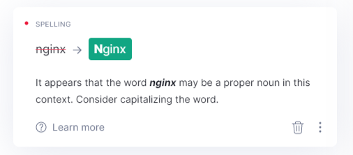

Actually there's a strange reason that I prefer HAProxy than nginx as my ingress controller.

When I was using nginx as the controller, the controller is often unresponsive to Ingress object webhooks.  
It results in failures of applying Ingress objects. To recover from this, I have to manually restart the nginx pods.  

The weird thing is that the ingress traffic is still routed. (But the controller rejects any updates)

Instead of digging into this problem, I would rather save my time and use something else.

---

Grammarly says you should capitialize `nginx`.

